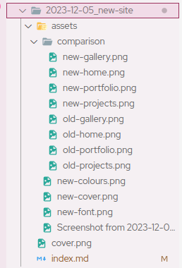
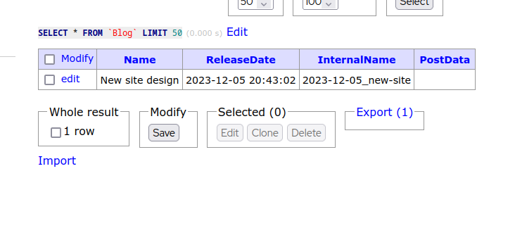

I wanted to make some blog posts recently about a few various things, but I found myself having nowhere to put them, so I decided to whip up one myself.

Today I decided to update my site's design, which you can read about [here](/blog?post=2023-12-05_new-site), but while I was at it, I decided to build up a little blog system!

---

First was deciding how to host the raw files. I decided to go with Github, inspired by how osu!wiki does it.

My idea is that each post has a folder, and in each folder is a markdown file for the blog post, a cover.png for the cover photo, and then an assets folder for any images it uses. Here's the folder for the aforementioned new design



You can see all the images go in assets, and the index.md contains the main text content.

What's important is, how does the site itself get this content? Well, I was a bit sneaky with that. On first load, the page fetches all the blogs from the database. They're added here separately, like so:



Now, when the page loads, it checks if post data is null. This only happens once, since if it is, we can fetch the markdown from Github's raw data url, and pop that into the content field

```php
if($post['PostData'] == null) {
    $post['PostData'] = file_get_contents("https://raw.githubusercontent.com/Tanza3D/blog/main/".$post['InternalName']."/index.md");
    Database::execOperation("UPDATE `Blog` SET `PostData` = ? WHERE `InternalName` = ?", "ss", [$post['PostData'], $post['InternalName']]);
}
```

Now, all of a sudden, we have a perfect variable with our content, that we can then place into our page using [Marked.js](https://github.com/markedjs/marked)! Apart from that... How do you load the images?

Well that's the funny thing, we don't, we just point to Github >:3

I'm sure that's probably against their terms or something, but for my little personal blog does it reallyyyy matter? :^)

The rest is just code really, but we end up with a nice, usable blog system, which only took a little over an hour to develop! Because I *despise* Medium.

If you didn't know, this blog, along with my entire website, is available open source on [Github (@Tanza3D/tanza-web/)](https://github.com/Tanza3D/tanza-web/) if you're interested in having a peek around!