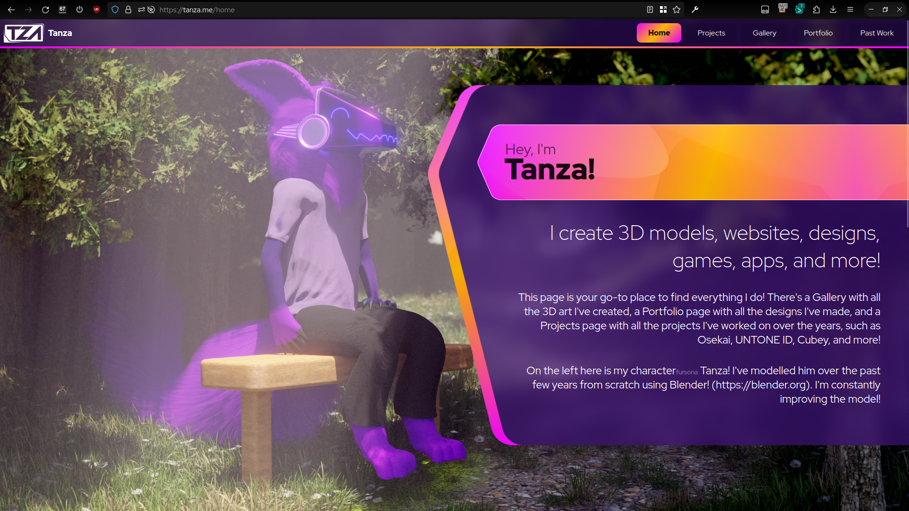
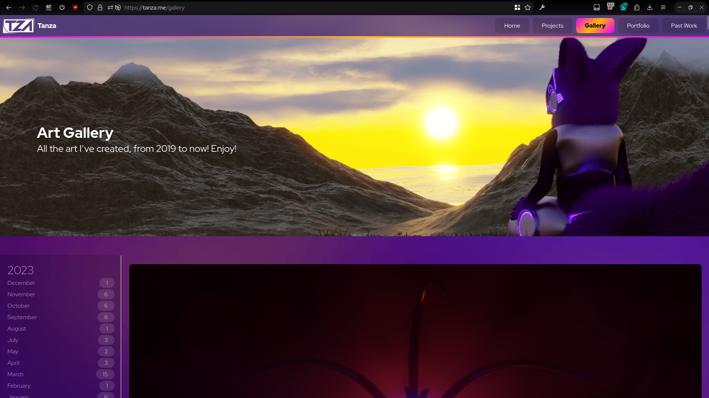
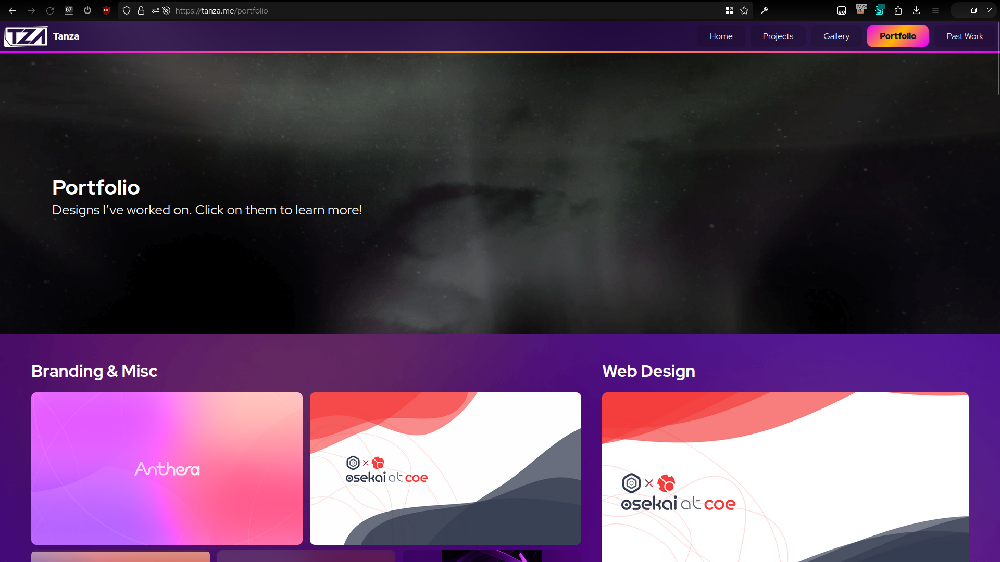

I really wasn't happy with my old site design, the layout was great, but the colours seemed too saturated, and it felt a bit too big on the screen. I decided to take a few hours to try fix it up!

First of all, for reference here's the old look:
 

Let me list some of the things I really do not like about this design:
- Font
This font at the time I used it was brand new to me. Nowadays I use it much too much, and it feels a bit too generic.
- Design
The design feels a little boring, especially the headers with their bright images
- Colours
The colours are much too saturated, especially with the background (it even uses an image!)
- Navbar
The navbar layout is fine, but the buttons on the right just aren't great, that gradient is very harsh on a small area.

Let's tackle each issue one at a time.

### Font
For a new font, my go-to place as of recent has been [Fontshare](https://www.fontshare.com/), I absolutely loved their fonts. I tried *Ranade* first, but it looked off, so secondly I tried a more basic *Satoshi* and it looked great.

### Design
The only thing I had qualms with in the page design area of things were the cover and page widths, so I added some border radius and padding to the cover, made it smaller, and blurred the image, and that made it look nicer.

With this, I also updated it to pick a random "wide" image (aspect ratio wider than 1:1) out of the 10 most recently uploaded images to the page.

### Colours
To fix the colours, I basically went through each one and desaturated it a bunch, and removed some gradients from around the page. That cleaned it up quite nicely. With this, I also pulled down the page width a bit, to let everything breathe some more

### Navbar
In the above image, you can see I also fixed the issue of the navbar. I made the gradient trim on the bottom thinner, and also highlighted the selected page by using a white line on the bottom instead of the gradient background.

----

The thing about all of this, is that I never designed or conceptualized any of this, it was just a few simple steps I knew I could take to drastically improve the look of the site.

Here's some comparisons across pages of the site!

||Old|New|
|---|---|---|
|Home|||
|Projects|||
|Gallery|||
|Portfolio|||

I do have to get around to adding cover images to the portfolio and projects page at some point, but beyond that I'm happy with this new addition!